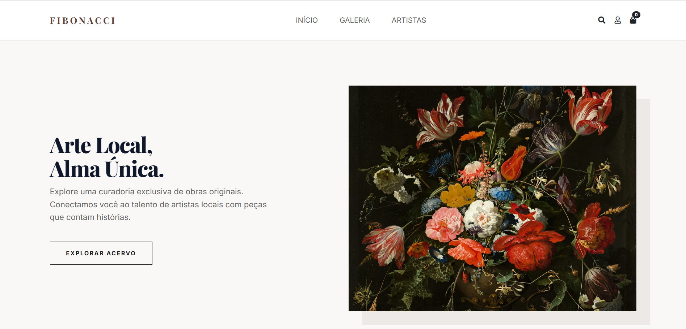

# 🎨 Fibonacci - Galeria de Artes (Frontend)




> O **Fibonacci** é uma plataforma web desenvolvida com **React** que conecta artistas locais e amantes da arte, oferecendo uma interface interativa e responsiva para exposição, descoberta e gerenciamento de obras únicas.

## ✨ Sobre o Projeto

O projeto foca na valorização da arte regional, permitindo a navegação por perfis de artistas, visualização de galerias e simulação de compra. O frontend foi construído como uma Single Page Application (SPA), garantindo uma navegação rápida e uma experiência de usuário elegante.

### Funcionalidades Atuais:
- **Roteamento Dinâmico**: Estrutura de navegação completa utilizando `react-router-dom` para páginas como Galeria, Artistas, Carrinho, Login, Cadastro e Detalhes da Obra.
- **Gerenciamento de Estado**: Configuração de estado global utilizando Redux e Redux Toolkit.
- **Interface e Estilização**: Componentes responsivos e estilizados utilizando Material-UI (MUI), React-Bootstrap e Emotion.
- **Comunicação com a API**: Estruturação inicial para consumo de dados do backend (Django) via Axios.
- **Sistema de Pagamento**: Preparação da interface de checkout com a integração do `react-paypal-button-v2`.
---

### 🛠️ Em Desenvolvimento (Próximas Etapas)

O projeto está em fase de integração contínua e aprimoramento da interface. Os próximos passos são:

- [ ] **Filtros por Categoria**: Consumir os dados do backend para filtrar obras de arte por tipo e artistas na página da Galeria.
- [ ] **Autenticação Real**: Sincronizar o Login e o Cadastro de usuários e artistas com a validação via tokens do servidor.
- [ ] **Gestão do Carrinho**: Finalizar a lógica de persistência do carrinho utilizando o `redux-persist`.
---

## 💻 Pré-requisitos

Antes de começar, verifique se você atendeu aos seguintes requisitos:

- Você instalou a versão mais recente do `Node.js` (que inclui o `npm`).
- Recomendado: Um editor de código como VSCode.
---

## 🚀 Instalando Fibonacci (Frontend)

Para instalar as dependências e rodar o projeto localmente, siga estas etapas:

Linux, macOS e Windows:

# Clone o repositório
```bash
git clone https://github.com/StephanieCaroll/Fibonacci-Frontend.git
```
# Entre no diretório
```
cd Fibonacci-Frontend/frontend
```
# Instale as Dependências
```
npm install
```

## ☕ Usando Fibonacci
Para iniciar o servidor de desenvolvimento, execute:
```
npm start
```
Acesse http://localhost:3000 no seu navegador. O projeto está configurado com um proxy apontando para http://127.0.0.1:8000 para facilitar as requisições locais com a API.

## 👥 Colaboradores
Agradecemos às seguintes pessoas que contribuíram para este projeto:

<table>
  <tr>

  
  <td align="center">
      <a href="https://github.com/EmillyMarrocos" title="Emilly Marrocos">
        <br>
        <sub><b>Emilly Marrocos</b></sub>
      </a>
    </td>

  <td align="center">
      <a href="https://github.com/FabianneArezes" title="Fabiane">
        <br>
        <sub><b>Fabiane</b></sub>
      </a>
    </td>

  <td align="center">
      <a href="https://github.com/joanads-coder" title="Joana Daniely">
        <br>
        <sub><b>Joana Daniely Silva</b></sub>
      </a>
    </td>

  <td align="center">
      <a href="https://github.com/lucasand-dev1" title="Lucas Gabriel Santos">
        <br>
        <sub><b>Lucas Gabriel Santos de Andrade</b></sub>
      </a>
    </td>

 <td align="center">
      <a href="https://github.com/StephanieCaroll" title="Stephanie Caroline">
        <br>
        <sub><b>Stephanie Caroline</b></sub>
      </a>
    </td>
    
  </tr>
</table>


## 📫 Contribuindo para Fibonacci


Para contribuir com **Fibonacci**, siga estas etapas:

1. Bifurque este repositório.
2. Crie um branch:  
   ```bash
   git checkout -b minha-feature
   ```
3. Faça suas alterações e confirme-as:
   ```bash
   git commit -m 'feat: nova funcionalidade'
   
4. Envie para o branch original:
  ```bash
  git push origin minha-feature
```
5. Crie a solicitação de pull.
Como alternativa, consulte a documentação oficial do GitHub sobre pull requests.

## 🤝 Contribuições

Sinta-se à vontade para contribuir com este projeto!

💡 Sugira novas funcionalidades e melhorias.  
🐛 Relate bugs ou problemas encontrados.  
📚 Compartilhe recursos ou ideias para o design.

   
